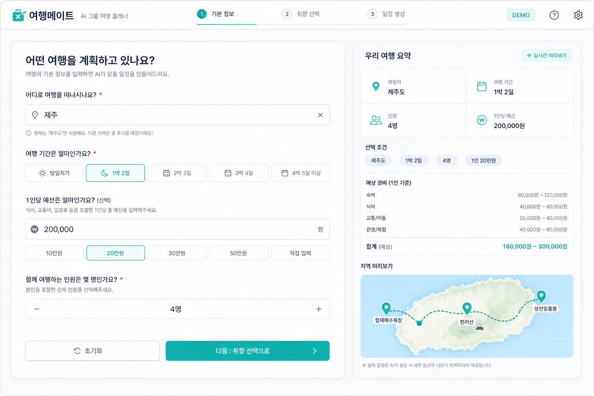
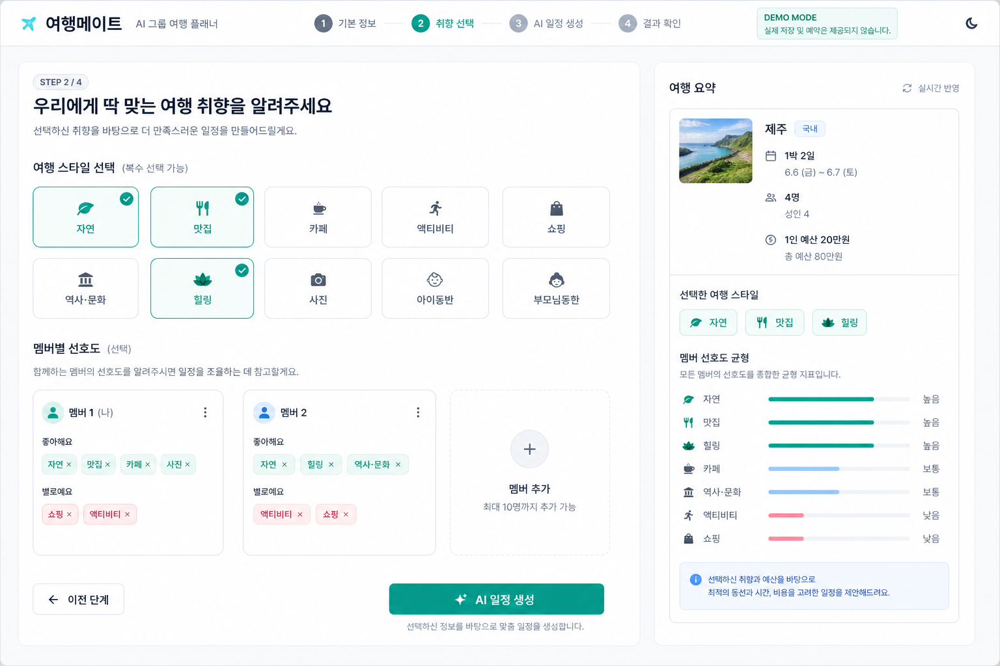
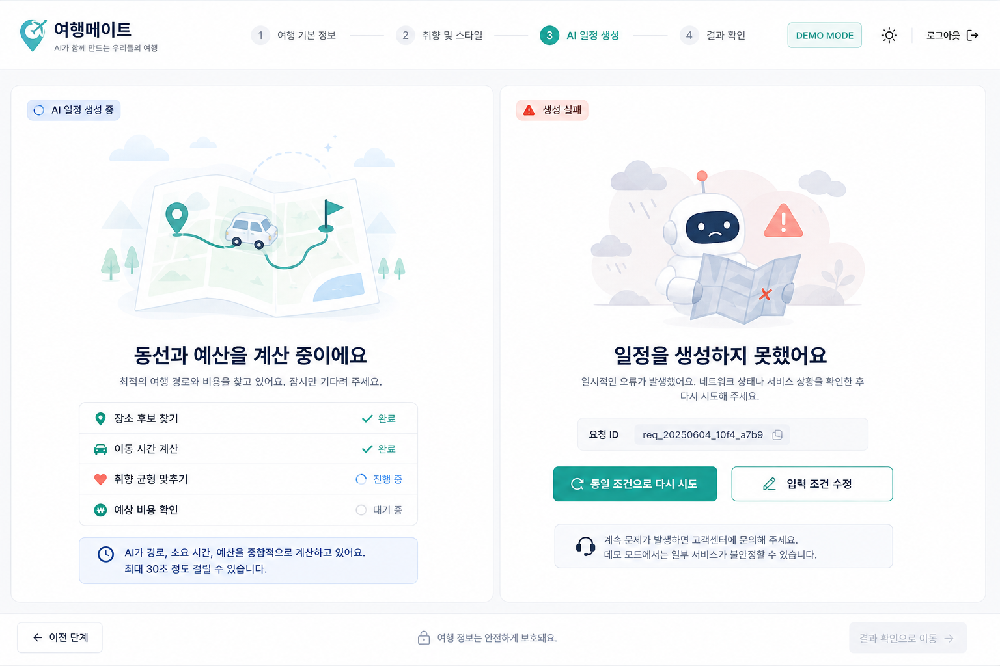
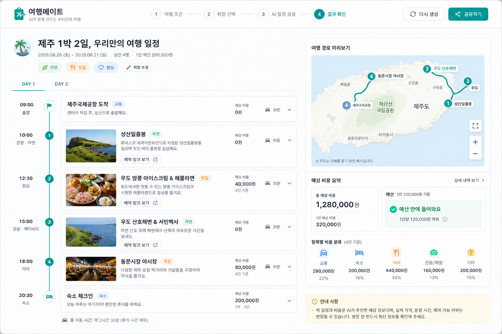

# Screen UI Specifications

이 문서는 화면별 기능, 상태, 레이아웃, 개발 완료 조건을 정의한다.
구현 시 `DESIGN.md`와 함께 사용한다.

## Screen Map

| 화면 | 경로 제안 | 주요 기능 | 담당 기능 |
| --- | --- | --- | --- |
| 여행 기본 정보 입력 | `/plan` | 지역, 기간, 예산, 인원 | 여행 조건 입력 UI |
| 여행 취향 선택 | `/plan/preferences` | 스타일, 멤버 선호 | 여행 스타일 및 멤버 선호 UI |
| 일정 생성 상태 | `/plan/generating` | 로딩, 실패, 재시도 | 생성 로딩 및 실패 UI |
| 여행 결과 | `/trips/[tripId]` | 일정, 비용, 지도, 예약 링크 | 여행 결과 카드 UI |
| 공유 결과 | `/share/[tripId]` | 읽기 전용 결과, 공유 안내 | 공유 및 데모 화면 마감 |

## 1. 여행 기본 정보 입력

### Layout

- 상단 헤더에 로고, 단계 진행, `DEMO` 배지를 표시한다.
- 왼쪽에는 입력 폼, 오른쪽에는 `우리 여행 요약` sticky 패널을 배치한다.
- 오른쪽 요약에는 입력된 지역, 기간, 인원, 예산과 지도 미리보기를 표시한다.

### Components

- 지역 검색 필드
- 기간 선택 segmented control: 당일치기, 1박 2일, 2박 3일, 직접 선택
- 1인당 예산 숫자 입력
- 인원 stepper: 2명부터 10명
- `다음` 기본 버튼

### States

- 초기: 추천 입력 예시와 빈 요약 표시
- 입력 중: 요약 패널 즉시 갱신
- 검증 실패: 필드 하단 인라인 오류와 첫 오류 필드 포커스
- 직접 선택: 시작일과 종료일 입력 표시

### Completion Criteria

- 사용자가 지역, 기간, 예산, 인원을 입력할 수 있다.
- 유효하지 않은 값은 다음 단계로 넘어가지 않는다.
- 데스크톱에서 폼과 요약이 동시에 보인다.

## 2. 여행 취향 선택

### Layout

- 기본 정보 화면과 같은 그리드와 헤더를 유지한다.
- 왼쪽에는 여행 스타일과 멤버별 선호, 오른쪽에는 선택 요약과 취향 균형을 표시한다.

### Components

- 여행 스타일 `ChoiceChip` 목록
- 멤버별 `MemberPreferenceCard`
- 선호 및 비선호 태그
- 멤버 추가 및 제거 버튼
- `이전`, `AI 일정 생성` 버튼

### States

- 스타일 미선택: 생성 버튼 비활성화 및 안내
- 멤버 선호 없음: 대표 여행 스타일 적용 안내
- 멤버 최대 10명: 추가 버튼 비활성화
- 선호와 비선호 중복: 인라인 오류

### Completion Criteria

- 최소 1개의 여행 스타일을 선택할 수 있다.
- 멤버 선호는 선택 사항이며 비어 있어도 생성 요청이 가능하다.
- 선택 내용이 오른쪽 요약에 반영된다.

## 3. 일정 생성 상태

### Generating State

- 중앙에 동선 애니메이션 또는 진행 시각화를 표시한다.
- 메시지: `동선과 예산을 계산 중이에요`
- 진행 항목: 장소 후보 찾기, 이동 시간 계산, 취향 균형 맞추기, 예상 비용 확인
- 최대 30초가 걸릴 수 있다는 안내를 표시한다.
- 입력 수정 버튼은 제공하지 않는다.

### Failed State

- 메시지: `일정을 생성하지 못했어요`
- 사용자에게 안전한 설명과 `requestId`를 표시한다.
- 기본 액션: `동일 조건으로 다시 시도`
- 보조 액션: `입력 조건 수정`
- 오류 원문, 비밀키, 내부 스택은 표시하지 않는다.

### Completion Criteria

- 생성 중과 실패 상태가 시각적으로 명확히 구분된다.
- 실패 후 사용자가 재시도 또는 입력 수정 경로를 선택할 수 있다.
- 로딩 메시지가 보조 기술에 전달된다.

## 4. 여행 결과

### Layout

- 상단에 여행 제목, 스타일 태그, `다시 생성`, `공유하기`를 표시한다.
- 왼쪽에는 일자별 일정 타임라인, 오른쪽에는 sticky 지도와 비용 요약을 배치한다.

### Components

- `DayTabs`
- `RouteTimeline`
- `PlaceCard`
- `MapPanel`
- `CostSummaryCard`
- 카테고리별 비용 요약
- 실제 가격 및 예약 가능 여부 면책 안내

### Place Card Content

- 방문 시간
- 장소명
- 카테고리
- 예상 비용
- 이전 장소에서 이동 시간
- `예약 링크 보기` 외부 링크 버튼

### States

- 예산 이내: 성공 상태와 `예산 안에 들어와요`
- 예산 초과: 경고 상태와 초과 금액 안내
- 예약 링크 없음: 버튼을 숨기고 안내 문구 표시
- 지도 로딩 실패: 일정은 유지하고 지도 대체 안내 표시

### Completion Criteria

- 사용자가 일자별 방문 순서, 이동 시간, 비용을 이해할 수 있다.
- 지도 실패가 일정 전체를 가리지 않는다.
- 공유와 재생성 액션이 눈에 띄지만 일정 읽기를 방해하지 않는다.

## 5. 공유 결과

### Layout

- 결과 화면과 동일한 읽기 구조를 사용한다.
- 입력 수정과 재생성 액션은 숨긴다.
- 상단에 `공유받은 여행 일정` 안내와 원본 생성 시각을 표시한다.

### States

- 정상: 읽기 전용 일정과 지도 표시
- 만료 또는 없음: `공유된 일정을 찾을 수 없어요` 안내와 새 일정 만들기 버튼
- 링크 복사 성공: 토스트와 복사 완료 텍스트 표시

### Completion Criteria

- 공유 URL 방문자가 로그인 없이 결과를 읽을 수 있다.
- 멤버별 민감한 선호 정보는 표시하지 않는다.
- 만료된 결과에서 새 일정 생성 경로를 제공한다.

## Shared Empty And Demo States

- 첫 방문 빈 상태에는 제주 예시 일정과 추천 입력값을 표시한다.
- `DEMO_MODE=true`에서는 헤더에 작은 `DEMO` 배지를 표시한다.
- 데모 배지는 실제 서비스 기능처럼 과도하게 강조하지 않는다.
- 빈 상태의 예시 데이터는 실제 사용자 입력으로 오해되지 않도록 `예시` 레이블을 표시한다.

